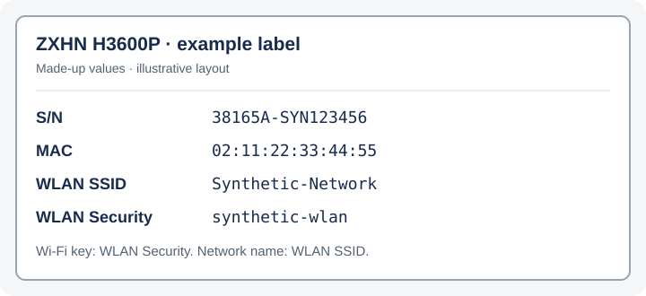

# Internet settings for Yettel Serbia

Get the internet (PPPoE) username and password for your own **Yettel / Cetin Serbia** line to use your own router.

**Independent, unofficial tool. Not affiliated with, endorsed by or supported by Yettel, CETIN or ZTE. These names identify compatible services and hardware and belong to their respective owners. Use only your own router and subscription.** The app identifies itself to the provider as your router. The provider may change management credentials or affect the original router; cancellation does not undo those changes. Credentials are saved on this computer. The app does not configure your router or computer's network settings.

[Download](#download) · [Steps](#steps) · [Router setup](#set-up-your-router) · [Troubleshooting](#troubleshooting) · [Your data](#your-data)

## Download

Open [Releases](https://github.com/stlk0/yettel-cwmp/releases/latest), choose your computer's archive, and extract all files. Replace `<version>` with the release version.

| Computer | Archive |
|---|---|
| Windows, Intel/AMD 64-bit | `yettel-cwmp-<version>-windows-x64.zip` |
| Windows on ARM | `yettel-cwmp-<version>-windows-arm64.zip` |
| macOS, Apple Silicon or Intel | `yettel-cwmp-<version>-macos-universal.tar.gz` |
| Linux, Intel/AMD 64-bit | `yettel-cwmp-<version>-linux-x64.tar.gz` |
| Linux, ARM 64-bit | `yettel-cwmp-<version>-linux-arm64.tar.gz` |

No installation or administrator rights are needed. Downloads are unsigned; check their origin, `SHA256SUMS` and available build provenance using the [verification instructions](docs/maintaining.md#verify-a-download). Keep the included license notices with the executable.

## First run

**Windows:** double-click `yettel-cwmp.exe` or run it in Windows Terminal. For an unrecognized-app warning, verify the download and follow [Microsoft's SmartScreen guidance](https://learn.microsoft.com/en-us/windows/apps/package-and-deploy/smartscreen-reputation). Managed-device policy may prevent execution; do not disable system-wide security.

**macOS or Linux:** open a terminal in the extracted folder:

```sh
chmod +x ./yettel-cwmp
./yettel-cwmp
```

The macOS app is unsigned and not notarized. For a verified download, follow [Apple's per-app opening instructions](https://support.apple.com/en-au/102445). Do not override a malware or damaged-file warning.

Use a terminal at least **52 columns × 16 rows**. Select English or Serbian Latin with `--lang en` or `--lang sr`; otherwise the system locale is used, with English as fallback. Set `NO_COLOR=1` before starting to disable colors. `--help` and `--version` also work without a terminal.

## What you need

- Your **ZTE ZXHN H3600P V9.0** label: serial number, MAC address and case-sensitive Wi-Fi key. The serial's `38165A-` prefix is optional; MAC addresses accept colons, hyphens or no separators.
- Internet access to the provider's management server. Receiving settings was tested over an active Yettel/CETIN line through a replacement router, with the original ZTE disconnected. The server was also reachable from another network, but receiving settings from other providers' networks was not tested.
- Your replacement router's setup page or manual.

See the [tested scope](docs/maintaining.md#tested-scope) for what these checks establish.

### Read the router label

These captions were checked on a Yettel-supplied ZXHN H3600P label:

| Label caption | App field |
|---|---|
| **S/N** | Serial number |
| **MAC** | MAC address |
| **WLAN Security** | Wi-Fi key; preserve uppercase and lowercase letters |
| **WLAN SSID** | Wi-Fi network name; the app does not ask for it |



The diagram uses made-up values and an illustrative layout. Enter the values from your own label. Never share your label photo, keys or saved credential files in an issue.

## Steps

1. Choose **Add a router (N)** and enter the label values. **Tab/Up/Down** changes fields; **Ctrl+U** clears a field. **Ctrl+R** or **F2** reveals or hides the Wi-Fi key. Pasted text is entered as data.
2. Choose **Receive internet settings (R)**. Read the warning, shown **before every connection**, and press **Enter** to continue. **Esc** cancels; provider changes already made remain in effect.
3. The result hides both credentials initially. **S** reveals or hides them; **C** copies the password and **U** copies the username. **PgUp/PgDn** and **Home/End** scroll the result and setup guidance.
4. Follow [Set up your router](#set-up-your-router). **V** opens saved settings without a network connection. **K** changes the Wi-Fi key; replacing provider-issued credentials requires confirmation. **D** deletes the router's local data after confirmation.

On menus, **Up/Down** or **Tab** selects an action and **Enter** chooses it. **Esc** goes back or cancels; **Q** quits outside text fields; **Ctrl+C** quits from anywhere. **?** or **F1** opens help. Quitting during a session waits for accepted credential changes to finish saving.

Copying needs terminal clipboard support; in tmux, enable `set -g set-clipboard on`. If copying fails, reveal the values and use terminal selection. Clipboard history or synchronization may retain copied credentials.

### What it looks like

Welcome (synthetic loopback session):

```text
Yettel internet settings  |  ZTE H3600P
┌──────────────────────────────────────────────────────────────────────────────┐
│Welcome                                                                       │
│                                                                              │
│This app gets the internet (PPPoE) username and password for your Yettel line,│
│so you can use your own router.                                               │
│You need the label of your router: serial number, MAC address and Wi-Fi key.  │
│The app saves credentials on this computer. The provider may change router    │
│management settings during a session.                                         │
│                                                                              │
│                                                                              │
│> Add a router (N)                                                            │
│  Quit (Q)                                                                    │
│                                                                              │
│                                                                              │
│                                                                              │
│                                                                              │
│                                                                              │
│                                                                              │
│                                                                              │
│                                                                              │
│                                                                              │
└──────────────────────────────────────────────────────────────────────────────┘
N Add  Q Quit  ? Help
```
Received settings, hidden by default (synthetic loopback session):

```text
Yettel internet settings  |  ZTE H3600P
┌──────────────────────────────────────────────────────────────────────────────┐
│Done: internet settings received                                             ▲│
│                                                                             █│
│Connection type: PPPoE                                                       █│
│Username: ••••••••  (press S to show)                                        █│
│Password: ••••••••  (press S to show)                                        █│
│VLAN ID: 710 *                                                               █│
│MTU: 1492 *                                                                  █│
│                                                                             █│
│* Typical values for this provider, not received from it. If the connection  █│
│fails, confirm them with your provider.                                      █│
│                                                                             ║│
│Set up your router                                                           ║│
│1. Choose PPPoE as the internet (WAN) connection type.                       ║│
│2. Enter the username and password shown above.                              ║│
│3. If your fiber box sends tagged traffic, set VLAN ID 710. If not, leave VLA║│
│off. Do not tag twice.                                                       ▼│
│> Show credentials (S)                                                        │
│  Copy password (C)                                                           │
│  Copy username (U)                                                           │
│  Back (Esc)                                                                  │
└──────────────────────────────────────────────────────────────────────────────┘
S Show  C Copy  PgUp/PgDn Scroll  ? Help
```

## Set up your router

Credentials alone may not be enough: internet traffic must reach the correct WAN interface.

| Setting | Value | Source |
|---|---|---|
| Internet/WAN connection | PPPoE | Bundled preset |
| Username and password | Reveal with **S** | Received from the provider |
| Internet VLAN ID | **710** | Typical preset; confirm for your line |
| VLAN priority (802.1p) | **0** | Typical preset; confirm for your line |
| PPPoE MTU | **1492** | Typical preset; confirm for your line |

Connect the replacement WAN port to the ONT's internet Ethernet handoff or upstream bridge. A routed LAN port is not automatically a PPPoE bridge; ask the provider whether Bridge mode is needed. Receiving credentials does not enable it.

For a tagged handoff, enable **802.1Q** with the confirmed VLAN ID and run PPPoE on that interface. Some routers place this under **IPTV/VLAN**; avoid tagging twice. Leave WAN tagging off for an untagged handoff. Enter the credentials, apply the confirmed MTU, and keep normal router mode with NAT and automatic IP/DNS unless your subscription requires otherwise.

After saving, check for an assigned IP address. A discovery timeout calls for checking cabling, bridge handoff and VLAN; authentication rejection calls for checking credentials. The app does not verify these presets for your subscription or configure your ONT.

### TV / IPTV

Television needs separate setup. The app does not obtain complete IPTV configuration or a TV login.

Reference values for a dedicated IPTV connection are **VLAN 712**, **DHCP**, **802.1p priority 5** and **MTU 1500**. Port/bridge mapping and multicast/IGMP settings may also be needed; confirm them with your provider. TV apps or boxes using ordinary internet may need a different setup, so VLAN 712 is not universal.

## Troubleshooting

The error screen always includes the session stage and last RPC. Report the app version, operating system and error code; never attach credentials, labels, saved files or raw traffic.

| Code | Meaning and next step |
|---|---|
| `IN-SERIAL` | Enter 6–64 letters/digits; check the optional label prefix. |
| `IN-MAC` | Enter a valid, nonzero unicast MAC address. |
| `IN-KEY` | Enter the case-sensitive Wi-Fi key from the label. |
| `IN-TEXT` | Remove line breaks/control characters; keys allow up to 1,024 characters. |
| `PR-EXISTS` | Open the saved router and use **K** to change its key. |
| `PR-CONFLICT` | The serial is saved with another MAC; check the label or delete that profile. |
| `PR-MISSING` | Add the router before receiving settings. |
| `PR-INVALID` | The saved router profile cannot be read; check your data before deleting and adding the router again. |
| `NO-EXPORT` | No settings are saved yet, or the saved file is damaged; choose **R** to receive them again. |
| `PR-LOCKED` | Another app instance uses this data folder; close it and retry. |
| `ST-ACCESS` | Check folder permissions or choose a writable data folder. |
| `ST-SPACE` | Free disk space and retry. |
| `ST-OTHER` | A storage operation failed; retry and report the code if it persists. |
| `NET-DNS` | Check internet access; the provider's name could not be resolved. |
| `NET-CONNECT` | The server could not be reached; check connectivity and try later. |
| `NET-TIMEOUT` | The server did not respond in time; try later. |
| `NET-OTHER` | The connection failed or was interrupted; retry. |
| `TLS-PIN` | Server identity changed; check for a new release. There is no bypass. |
| `TLS-HANDSHAKE` | Secure connection failed; try later or check for an updated release. |
| `ACS-AUTH` | Check the label key and use **K**. If the provider set the credentials earlier, retry later first; replacing them requires confirmation. |
| `ACS-HTTP` | The provider returned an error status; try later. |
| `ACS-PROTOCOL` | Unexpected provider response; retry, then report the code. |
| `ACS-INCOMPLETE` | Both internet credentials were not received; retry or ask your provider. |
| `CANCELLED` | Cancelled; provider changes already made remain. |
| `SESSION-TIMEOUT` | The 15-minute session limit was reached; try later. |
| `TERM` | Start the app in a regular terminal window. |
| `INTERNAL` | Report the version, code and safe source location if printed. |

A complete received credential pair is still saved after late cancellation, timeout or connection loss. Provider, identity and persistence errors remain errors. Incomplete captures leave the previous export intact; management credentials already received may have changed.

## Your data

Saved files contain **plaintext credentials**. Use a private local folder and keep it out of shared or synchronized locations.

| System | Default folder |
|---|---|
| Linux | `$XDG_STATE_HOME/yettel-cwmp`, or `~/.local/state/yettel-cwmp` |
| Windows | `%LOCALAPPDATA%\yettel-cwmp` |
| macOS | `~/Library/Application Support/yettel-cwmp` |

`--state-dir DIR` chooses another folder. Each router has `devices/<serial>/profile.json` and, after success, `extracted-credentials.json`. On Unix, newly created folders use 0700 and files use 0600; existing folder permissions stay unchanged. Windows files inherit access from their containing folder.

Use **D** to remove a router's local records, or close the app before deleting its data folder. Deletion does not undo provider changes or securely erase copies in backups, snapshots or clipboard history.

## Links

[Releases](https://github.com/stlk0/yettel-cwmp/releases/latest) · [Issues](https://github.com/stlk0/yettel-cwmp/issues) · [Development and releases](docs/maintaining.md) · [Security reporting](SECURITY.md) · [License](LICENSE)
